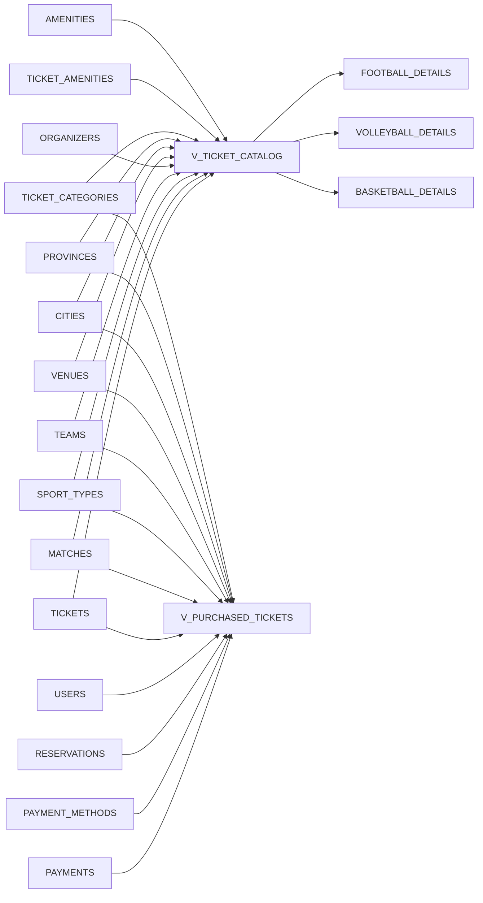
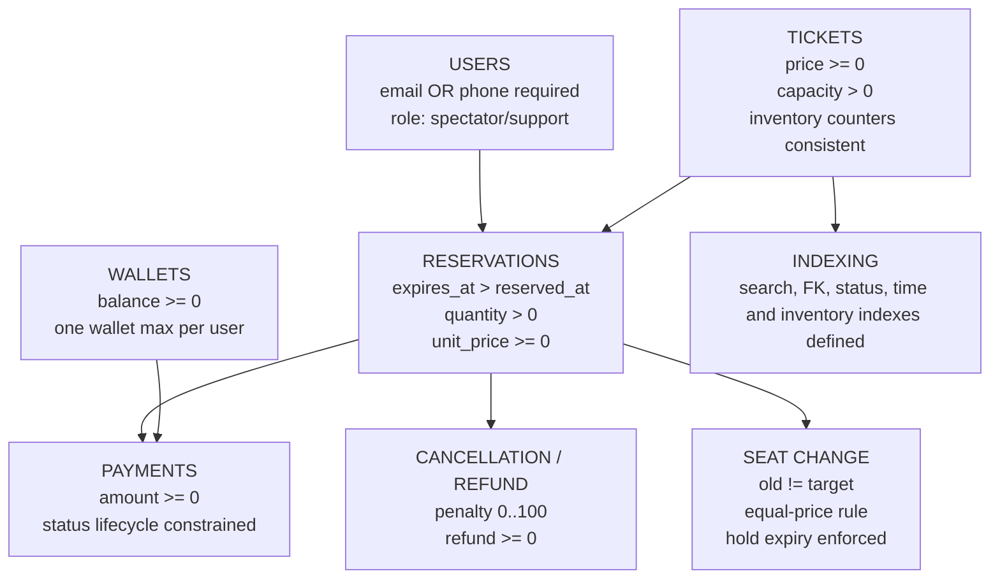

# ArenaPass — Final Physical ERD (Crow's Foot)

## Physical ERD

```mermaid
erDiagram

    PROVINCES ||--o{ CITIES : contains
    CITIES ||--o{ VENUES : contains
    CITIES o|--o{ USERS : residence
    CITIES o|--o{ TEAMS : base_city

    USERS ||--o| WALLETS : owns

    SPORT_TYPES ||--o{ TEAMS : classifies
    SPORT_TYPES ||--o{ MATCHES : classifies
    TEAMS ||--o{ MATCHES : home_team
    TEAMS ||--o{ MATCHES : away_team
    VENUES ||--o{ MATCHES : hosts
    ORGANIZERS ||--o{ MATCHES : organizes

    MATCHES ||--o{ TICKETS : offers
    TICKET_CATEGORIES ||--o{ TICKETS : classifies

    TICKETS ||--o{ TICKET_AMENITIES : has
    AMENITIES ||--o{ TICKET_AMENITIES : assigned

    USERS ||--o{ RESERVATIONS : makes
    TICKETS ||--o{ RESERVATIONS : reserved_as
    USERS o|--o{ RESERVATIONS : canceled_by
    USERS o|--o{ RESERVATIONS : support_reviewed_by

    RESERVATIONS ||--o{ PAYMENTS : payment_attempts
    PAYMENT_METHODS ||--o{ PAYMENTS : uses

    WALLETS ||--o{ WALLET_TRANSACTIONS : ledger
    PAYMENTS o|--o{ WALLET_TRANSACTIONS : referenced_by

    ORGANIZERS ||--o{ CANCELLATION_POLICIES : defines
    RESERVATIONS ||--o{ CANCELLATION_REQUESTS : has
    USERS ||--o{ CANCELLATION_REQUESTS : requested_by
    USERS o|--o{ CANCELLATION_REQUESTS : reviewed_by

    CANCELLATION_REQUESTS ||--o| REFUNDS : creates
    PAYMENTS ||--o| REFUNDS : reversed_by
    WALLETS ||--o{ REFUNDS : receives

    RESERVATIONS ||--o{ SEAT_CHANGE_REQUESTS : has
    USERS ||--o{ SEAT_CHANGE_REQUESTS : requested_by
    USERS o|--o{ SEAT_CHANGE_REQUESTS : reviewed_by
    TICKETS ||--o{ SEAT_CHANGE_REQUESTS : old_ticket
    TICKETS ||--o{ SEAT_CHANGE_REQUESTS : target_ticket

    RESERVATIONS ||--o{ ISSUED_TICKETS : issues

    USERS ||--o{ REPORTS : submits
    REPORT_CATEGORIES ||--o{ REPORTS : categorizes
    TICKETS o|--o{ REPORTS : ticket_target
    RESERVATIONS o|--o{ REPORTS : reservation_target
    PAYMENTS o|--o{ REPORTS : payment_target
    USERS o|--o{ REPORTS : assigned_to

    RESERVATIONS ||--o{ RESERVATION_STATUS_HISTORY : history
    USERS o|--o{ RESERVATION_STATUS_HISTORY : changed_by

    USERS o|--o{ API_AUDIT_LOG : actor

    USERS ||--o| SUPPORT_CONVERSATIONS : spectator
    USERS o|--o{ SUPPORT_CONVERSATIONS : assigned_support
    SUPPORT_CONVERSATIONS ||--o{ SUPPORT_MESSAGES : contains
    USERS ||--o{ SUPPORT_MESSAGES : sends

    PROVINCES {
        BIGINT id PK
        VARCHAR name UK
        TIMESTAMPTZ created_at
    }

    CITIES {
        BIGINT id PK
        BIGINT province_id FK
        VARCHAR name
        TIMESTAMPTZ created_at
    }

    VENUES {
        BIGINT id PK
        BIGINT city_id FK
        VARCHAR name
        TEXT address
        INTEGER capacity
        NUMERIC latitude
        NUMERIC longitude
        BOOLEAN is_active
        TIMESTAMPTZ created_at
        TIMESTAMPTZ updated_at
    }

    USERS {
        BIGINT id PK
        BIGINT city_id FK
        VARCHAR first_name
        VARCHAR last_name
        CITEXT email UK
        VARCHAR phone UK
        VARCHAR password_hash
        VARCHAR role
        DATE date_of_birth
        TEXT profile_picture_url
        VARCHAR preferred_login
        BOOLEAN is_active
        TIMESTAMPTZ created_at
        TIMESTAMPTZ updated_at
        INTEGER session_version
        TIMESTAMPTZ email_verified_at
        TIMESTAMPTZ phone_verified_at
        TIMESTAMPTZ last_login_at
    }

    WALLETS {
        BIGINT id PK
        BIGINT user_id FK,UK
        NUMERIC balance
        CHAR currency
        TIMESTAMPTZ created_at
        TIMESTAMPTZ updated_at
    }

    SPORT_TYPES {
        BIGINT id PK
        VARCHAR code UK
        VARCHAR name UK
        BOOLEAN is_active
        TIMESTAMPTZ created_at
    }

    TEAMS {
        BIGINT id PK
        BIGINT sport_type_id FK
        BIGINT city_id FK
        VARCHAR name
        VARCHAR short_name
        BOOLEAN is_active
        TIMESTAMPTZ created_at
    }

    ORGANIZERS {
        BIGINT id PK
        VARCHAR name UK
        CITEXT support_email UK
        VARCHAR support_phone UK
        BOOLEAN is_active
        TIMESTAMPTZ created_at
        TIMESTAMPTZ updated_at
    }

    MATCHES {
        BIGINT id PK
        BIGINT sport_type_id FK
        BIGINT home_team_id FK
        BIGINT away_team_id FK
        BIGINT venue_id FK
        BIGINT organizer_id FK
        VARCHAR tournament_name
        TIMESTAMPTZ starts_at
        TIMESTAMPTZ ends_at
        VARCHAR status
        BOOLEAN is_active
        TIMESTAMPTZ created_at
        TIMESTAMPTZ updated_at
    }

    TICKET_CATEGORIES {
        BIGINT id PK
        VARCHAR code UK
        VARCHAR name UK
        SMALLINT sort_order
        BOOLEAN is_active
    }

    TICKETS {
        BIGINT id PK
        BIGINT match_id FK
        BIGINT ticket_category_id FK
        VARCHAR section_code
        VARCHAR row_code
        VARCHAR seat_code
        BOOLEAN is_numbered
        NUMERIC price
        INTEGER total_capacity
        INTEGER held_quantity
        INTEGER sold_quantity
        INTEGER change_held_quantity
        INTEGER available_quantity
        TIMESTAMPTZ sale_starts_at
        TIMESTAMPTZ sale_ends_at
        BOOLEAN is_active
        TIMESTAMPTZ created_at
        TIMESTAMPTZ updated_at
    }

    AMENITIES {
        BIGINT id PK
        VARCHAR code UK
        VARCHAR name UK
        TEXT description
    }

    TICKET_AMENITIES {
        BIGINT ticket_id PK,FK
        BIGINT amenity_id PK,FK
        VARCHAR details
    }

    RESERVATIONS {
        BIGINT id PK
        BIGINT user_id FK
        BIGINT ticket_id FK
        VARCHAR status
        INTEGER quantity
        NUMERIC unit_price
        NUMERIC total_amount
        TIMESTAMPTZ reserved_at
        TIMESTAMPTZ expires_at
        TIMESTAMPTZ paid_at
        TIMESTAMPTZ canceled_at
        BIGINT canceled_by FK
        TEXT cancellation_reason
        TIMESTAMPTZ updated_at
        VARCHAR support_review_status
        BIGINT support_reviewed_by FK
        TEXT support_review_note
        TIMESTAMPTZ support_reviewed_at
    }

    PAYMENT_METHODS {
        BIGINT id PK
        VARCHAR code UK
        VARCHAR name UK
        BOOLEAN is_active
    }

    PAYMENTS {
        BIGINT id PK
        BIGINT reservation_id FK
        BIGINT payment_method_id FK
        NUMERIC amount
        VARCHAR status
        VARCHAR transaction_ref UK
        TEXT failure_reason
        TIMESTAMPTZ created_at
        TIMESTAMPTZ paid_at
    }

    WALLET_TRANSACTIONS {
        BIGINT id PK
        BIGINT wallet_id FK
        BIGINT payment_id FK
        VARCHAR transaction_type
        NUMERIC amount
        NUMERIC balance_after
        VARCHAR reference_code UK
        TEXT description
        TIMESTAMPTZ created_at
    }

    CANCELLATION_POLICIES {
        BIGINT id PK
        BIGINT organizer_id FK
        INTEGER hours_before_match
        NUMERIC penalty_percentage
        VARCHAR description
    }

    CANCELLATION_REQUESTS {
        BIGINT id PK
        BIGINT reservation_id FK
        BIGINT requested_by FK
        TEXT reason
        VARCHAR status
        NUMERIC estimated_penalty_pct
        NUMERIC estimated_refund
        BIGINT reviewed_by FK
        TEXT review_note
        TIMESTAMPTZ requested_at
        TIMESTAMPTZ reviewed_at
    }

    REFUNDS {
        BIGINT id PK
        BIGINT cancellation_request_id FK,UK
        BIGINT payment_id FK,UK
        BIGINT wallet_id FK
        NUMERIC amount
        NUMERIC penalty_amount
        VARCHAR status
        VARCHAR transaction_ref UK
        TIMESTAMPTZ created_at
        TIMESTAMPTZ completed_at
    }

    SEAT_CHANGE_REQUESTS {
        BIGINT id PK
        BIGINT reservation_id FK
        BIGINT requested_by FK
        BIGINT old_ticket_id FK
        BIGINT requested_ticket_id FK
        INTEGER quantity
        NUMERIC old_unit_price
        NUMERIC new_unit_price
        TIMESTAMPTZ target_hold_expires_at
        VARCHAR status
        BIGINT reviewed_by FK
        TEXT review_note
        TIMESTAMPTZ requested_at
        TIMESTAMPTZ reviewed_at
    }

    ISSUED_TICKETS {
        BIGINT id PK
        BIGINT reservation_id FK
        UUID ticket_number UK
        UUID qr_token UK
        VARCHAR status
        TIMESTAMPTZ issued_at
        TIMESTAMPTZ used_at
    }

    REPORT_CATEGORIES {
        BIGINT id PK
        VARCHAR code UK
        VARCHAR name UK
    }

    REPORTS {
        BIGINT id PK
        BIGINT reporter_id FK
        BIGINT ticket_id FK
        BIGINT reservation_id FK
        BIGINT payment_id FK
        BIGINT category_id FK
        VARCHAR subject
        TEXT description
        VARCHAR status
        BIGINT assigned_to FK
        TEXT support_response
        TIMESTAMPTZ created_at
        TIMESTAMPTZ updated_at
        TIMESTAMPTZ resolved_at
    }

    RESERVATION_STATUS_HISTORY {
        BIGINT id PK
        BIGINT reservation_id FK
        VARCHAR old_status
        VARCHAR new_status
        BIGINT changed_by FK
        TEXT note
        TIMESTAMPTZ changed_at
    }

    API_AUDIT_LOG {
        BIGINT id PK
        BIGINT actor_user_id FK
        VARCHAR action
        VARCHAR resource_type
        VARCHAR resource_id
        VARCHAR request_id
        VARCHAR ip_address
        JSONB metadata
        TIMESTAMPTZ created_at
    }

    SEARCH_SYNC_OUTBOX {
        BIGINT id PK
        BIGINT ticket_id
        INTEGER revision
        INTEGER attempts
        TIMESTAMPTZ available_at
        TIMESTAMPTZ locked_at
        VARCHAR locked_by
        TEXT last_error
        TIMESTAMPTZ created_at
        TIMESTAMPTZ processed_at
    }

    SUPPORT_CONVERSATIONS {
        BIGINT id PK
        BIGINT spectator_id FK,UK
        BIGINT assigned_to FK
        VARCHAR status
        VARCHAR subject
        TIMESTAMPTZ last_message_at
        TIMESTAMPTZ spectator_last_read_at
        TIMESTAMPTZ support_last_read_at
        TIMESTAMPTZ created_at
        TIMESTAMPTZ updated_at
    }

    SUPPORT_MESSAGES {
        BIGINT id PK
        BIGINT conversation_id FK
        BIGINT sender_id FK
        TEXT body
        TIMESTAMPTZ created_at
        TIMESTAMPTZ read_at
    }

    SYSTEM_BOOTSTRAP_STATE {
        SMALLINT id PK
        BOOLEAN completed
        TIMESTAMPTZ completed_at
    }

```

## Derived SQL Views

```mermaid
flowchart LR
    T[TICKETS] --> VC[V_TICKET_CATALOG]
    M[MATCHES] --> VC
    ST[SPORT_TYPES] --> VC
    TM[TEAMS] --> VC
    O[ORGANIZERS] --> VC
    V[VENUES] --> VC
    C[CITIES] --> VC
    PR[PROVINCES] --> VC
    TC[TICKET_CATEGORIES] --> VC
    TA[TICKET_AMENITIES] --> VC
    A[AMENITIES] --> VC

    VC --> F[FOOTBALL_DETAILS]
    VC --> VB[VOLLEYBALL_DETAILS]
    VC --> B[BASKETBALL_DETAILS]

    P[PAYMENTS] --> VP[V_PURCHASED_TICKETS]
    PM[PAYMENT_METHODS] --> VP
    R[RESERVATIONS] --> VP
    U[USERS] --> VP
    T --> VP
    M --> VP
    ST --> VP
    TM --> VP
    V --> VP
    C --> VP
    PR --> VP
    TC --> VP

```

## Phase-1 Logical Constraint Summary

```mermaid
flowchart TB
    U["USERS<br/>email OR phone required<br/>role: spectator/support"]
    T["TICKETS<br/>price >= 0<br/>capacity > 0<br/>inventory counters consistent"]
    R["RESERVATIONS<br/>expires_at > reserved_at<br/>quantity > 0<br/>unit_price >= 0"]
    P["PAYMENTS<br/>amount >= 0<br/>status lifecycle constrained"]
    W["WALLETS<br/>balance >= 0<br/>one wallet max per user"]
    C["CANCELLATION / REFUND<br/>penalty 0..100<br/>refund >= 0"]
    S["SEAT CHANGE<br/>old != target<br/>equal-price rule<br/>hold expiry enforced"]
    I["INDEXING<br/>search, FK, status, time and inventory indexes defined"]

    U --> R
    T --> R
    R --> P
    W --> P
    R --> C
    R --> S
    T --> I

```

